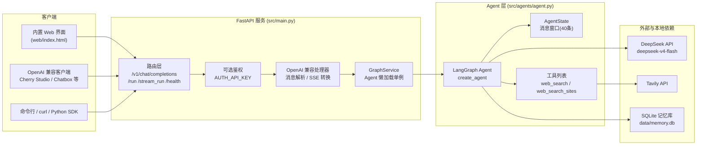
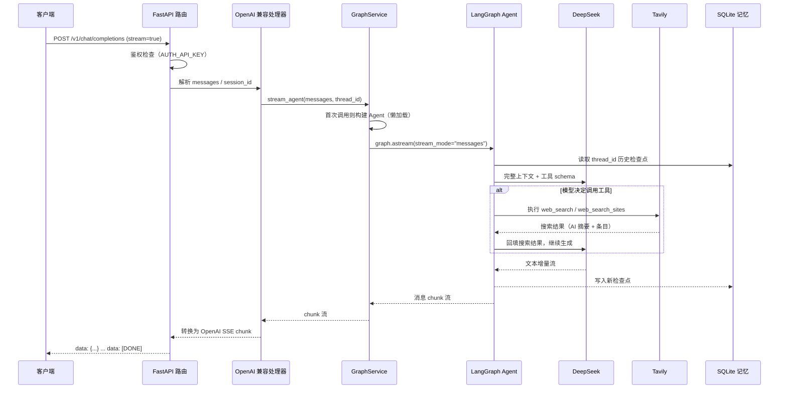
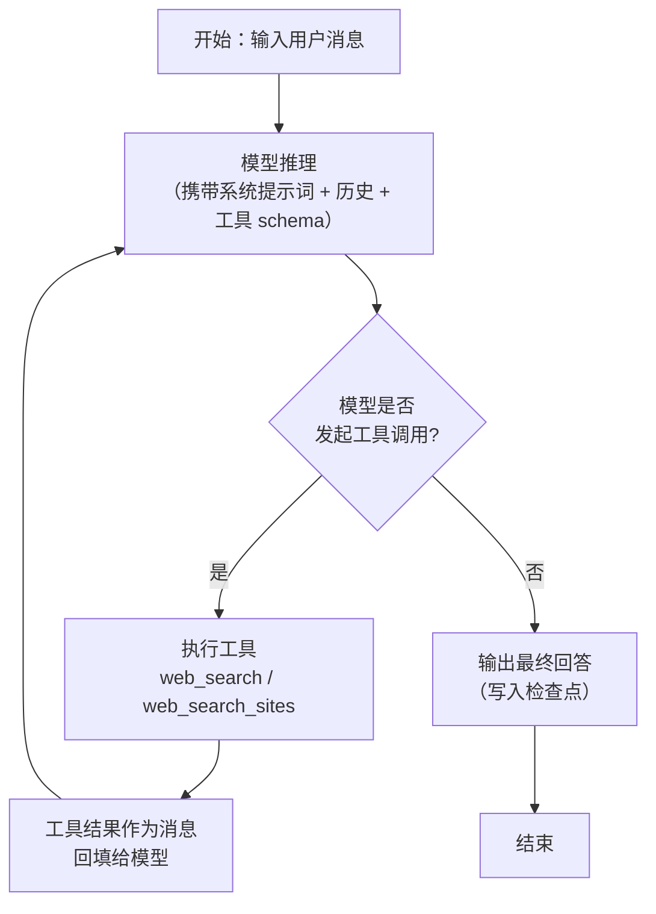
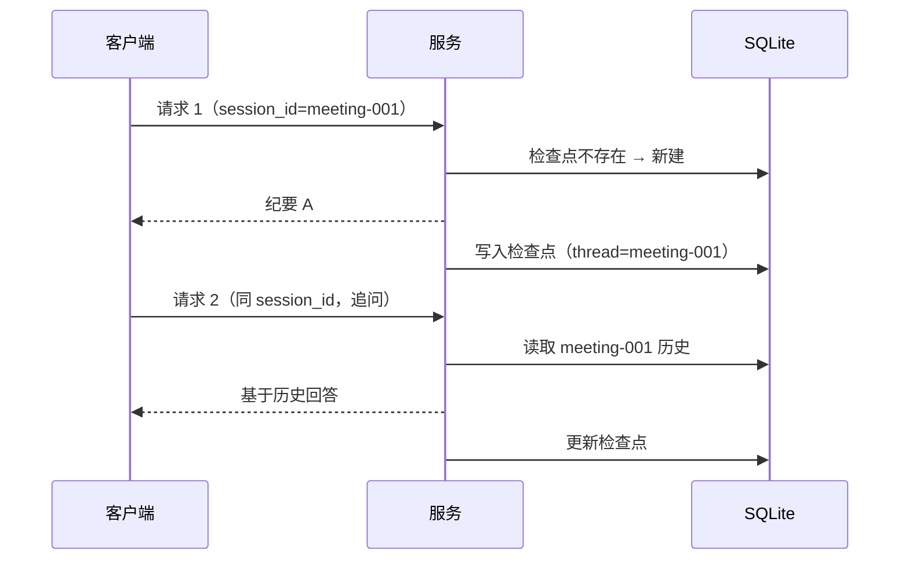

# 会议纪要助手 Agent 架构详解

> 本文档面向对该 Agent 的架构设计、运行机制、能力边界和扩展方式感兴趣的读者，是 [README.md](./README.md)（使用手册）的配套技术文档。

## 1. 定位与概览

这是一个**单服务、单 Agent 的会议纪要生成系统**：输入一段会议记录原文，输出结构化的四章节中文会议纪要。系统由三个外部依赖和若干内部模块组成：

- **DeepSeek**（大模型）：负责理解会议内容、决策是否搜索、撰写纪要
- **Tavily**（联网搜索）：提供网页检索与 AI 摘要，支撑背景补充与产品信息核对
- **本地 SQLite**（会话记忆）：持久化多轮对话上下文，重启不丢

对外暴露一个 OpenAI 兼容的 HTTP 服务（`/v1/chat/completions`），因此任何支持自定义 Base URL 的客户端、脚本、Web 页面都可以接入。

### 技术栈

| 层面 | 选型 | 用途 |
|---|---|---|
| 语言/运行时 | Python 3.12+ | - |
| Web 框架 | FastAPI + Uvicorn | HTTP 服务、SSE 流式 |
| Agent 框架 | LangChain `create_agent` + LangGraph | Agent 构建、决策循环、检查点 |
| 模型接入 | `langchain-openai`（OpenAI 兼容协议） | DeepSeek 对话 |
| 搜索 | Tavily REST API | 联网检索 + AI 摘要 |
| 记忆 | `langgraph-checkpoint-sqlite` + aiosqlite | 会话持久化 |
| 前端 | 原生 HTML/JS + marked | 内置 Web 界面 |

### 一条完整数据流（一句话版）

`HTTP 请求 → FastAPI 路由 → OpenAI 消息解析 → GraphService → LangGraph Agent 循环 →（模型 ↔ 工具）→ 结果聚合 → OpenAI SSE/JSON 响应`

## 2. 总体架构



### 模块职责

| 模块 | 文件 | 职责 |
|---|---|---|
| 服务入口 | `src/main.py` | 路由注册、鉴权、OpenAI 消息转换、SSE 流式输出、Agent 生命周期管理 |
| Agent 构建 | `src/agents/agent.py` | 读取提示词配置、初始化 LLM 与工具、调用 `create_agent` 编译图 |
| 搜索工具 | `src/tools/web_search_tool.py` | 封装 Tavily 搜索，提供通用搜索与站点限定搜索两个工具 |
| 会话记忆 | `src/storage/memory/memory_saver.py` | SQLite checkpointer 初始化与降级策略 |
| 系统提示词 | `config/agent_llm_config.json` | 角色定义、输出格式、工具使用指南、示例 |
| Web 界面 | `web/index.html` | 输入/输出界面，流式渲染 Markdown |
| 文件解析（预留） | `src/utils/file/file.py` | PDF/Word/Excel/PPT 文本提取，暂未接入 Agent |
| 启动脚本 | `scripts/*.sh` | 安装、启动、命令行调用 |

## 3. 核心能力拆解

### 3.1 会议纪要生成（提示词驱动）

系统的"业务灵魂"不在代码里，而在 [config/agent_llm_config.json](./config/agent_llm_config.json) 的系统提示词中。它把模型约束成一个专业会议纪要助手，核心规则包括：

- **角色与目标**：整理、润色、校对、补充，输出可直接流转的中文纪要
- **提炼原则**：保留量化数据、核心结论、承诺、时间节点；去掉重复和枝节
- **五步内部工作流**：研读抽取 → 背景补充（搜索）→ 产品核对（站点搜索）→ 结构化编排 → 质量检查
- **严格四章节输出**：
  1. 会议背景或客户背景（含会议基本信息、客户/项目信息、市场信息等，信息不足标「待确认」）
  2. 会议内容（按议题 + 数字编号要点，保留所有关键数据）
  3. 竞品情况与风险分析（含影响程度/可能性定性评估与缓解思路）
  4. 下一步计划（行动项 → 负责人 → 截止日期 → 优先级）
- **写作准则**：不得虚构、不输出思考过程、官网与外部来源冲突时以官网为准、文末附参考来源

这套提示词是原 Coze/豆包版原样迁移的，业务规则零改动。

### 3.2 联网搜索（Tavily）

[web_search_tool.py](./src/tools/web_search_tool.py) 提供两个 LangChain 工具：

| 工具 | 参数 | 行为 | 典型场景 |
|---|---|---|---|
| `web_search` | `query` | Tavily 通用搜索，`search_depth=advanced`、`max_results=10`、`include_answer=True` | 客户/项目背景、行业、竞品 |
| `web_search_sites` | `query, sites` | 把逗号分隔的域名映射为 Tavily `include_domains` | 核对网宿官网（`sites=wangsu.com`） |

返回格式与原 Coze 版保持一致：**AI 摘要 + 编号结果列表（标题/来源/URL/摘要/发布时间）**。Tavily 的 `answer` 字段替代了原 Coze 搜索 API 的 `summary`，站点限定由 `include_domains` 实现，功能等价。

### 3.3 会话记忆（SQLite）

记忆基于 LangGraph 的 **checkpointer（检查点）机制**：

- 每次 Agent 执行结束，把当时的完整消息状态写入检查点
- 检查点按 `thread_id` 组织，存储于 SQLite（默认 `data/memory.db`）
- 同一 `thread_id` 的新请求会先从检查点恢复历史消息，再追加新输入
- `AgentState` 中自定义了 `_windowed_messages` reducer：**只保留最近 40 条消息**，防止记忆无限膨胀

记忆初始化失败（如文件不可写）时自动降级为进程内 `MemorySaver`，服务不中断，代价是重启后记忆丢失。

### 3.4 HTTP / OpenAI 兼容服务

服务对外的核心接口是 `POST /v1/chat/completions`，支持：

- **非流式**：聚合完整回答，返回标准 `chat.completion` JSON
- **流式**：SSE 输出 `chat.completion.chunk`，包括角色占位、文本增量、工具调用增量、`finish_reason`、`[DONE]`
- **会话 ID**：通过请求体中的 `session_id`（或 `user`）字段指定，缺省为 `default`
- **可选鉴权**：设置 `AUTH_API_KEY` 后要求 `Authorization: Bearer <key>`

另有 `POST /run`（同步）、`POST /stream_run`（SSE）、`GET /health`（健康检查）。

### 3.5 Web 界面

`web/index.html` 是零依赖（仅本地 `marked.min.js`）的单页应用：

- 左侧粘贴会议记录，右侧流式渲染 Markdown 纪要
- 会话 ID 存浏览器 `localStorage`，刷新不丢；「新会话」按钮生成新 ID
- 支持 `Cmd/Ctrl + Enter` 快捷发送、一键复制结果

界面通过 `fetch` 直接调用本服务的 `/v1/chat/completions`（stream），由 FastAPI `StaticFiles` 挂载在根路径。

### 3.6 文件解析（预留能力）

`src/utils/file/file.py` 内置了文件下载（URL → 字节流）、类型推断和 PDF/DOCX/XLSX/PPTX 文本提取能力。当前**未接入 Agent 工具链**，是留给后续「上传会议录音转写稿、附件解析」等场景的扩展点。

## 4. 运行逻辑

### 4.1 一次请求的完整链路



### 4.2 Agent 内部决策循环

`create_agent` 构建的是标准 **ReAct 风格执行器**，循环直到模型不再要求调用工具：



关键点：

- 系统提示词明确指导模型**先评估是否需要搜索**（信息充分则不搜），避免无效 API 消耗
- 工具调用由模型自主发起，服务端自动执行并回填，客户端无感知
- 循环有 `recursion_limit=100` 上限，防止失控

### 4.3 流式输出机制

`graph.astream(..., stream_mode="messages")` 产出的是**消息级增量**（`AIMessageChunk`），服务端将其转换为 OpenAI SSE 格式：

1. 先发角色占位 chunk（`delta.role = "assistant"`）
2. 模型文本增量 → `delta.content`
3. 工具调用参数增量 → `delta.tool_calls`（按 `index` 累积 `arguments` 片段）
4. 结束 → `delta = {}` + `finish_reason = "stop"`
5. `data: [DONE]`

真实流式响应示例（简化）：

```text
data: {"choices":[{"delta":{"role":"assistant"}}]}
data: {"choices":[{"delta":{"content":"## 1、会议背景"}}]}
data: {"choices":[{"delta":{"content":"或客户背景："}}]}
data: {"choices":[{"delta":{},"finish_reason":"stop"}]}
data: [DONE]
```

### 4.4 会话记忆生命周期



服务重启不影响该机制——检查点在磁盘上，这正是 SQLite 相对内存方案的核心优势。

### 4.5 多轮对话场景

- 同一 `session_id` 反复发送会议记录 → 模型基于历史追问补充细节、修正纪要
- 不同 `session_id` 完全隔离 → 不同客户的会议互不干扰
- Web 界面「新会话」即生成新 `session_id`

## 5. 关键设计特点

### 5.1 本地优先，零平台绑定

除模型与搜索两个必用的云端 API 外，一切本地化：记忆用 SQLite 文件、前端静态托管、无任何 Coze/豆包 SDK 依赖、无遥测上报。可整体打包到任意内网/私有环境，只放行 `api.deepseek.com` 与 `api.tavily.com` 两个出口即可。

### 5.2 OpenAI 兼容即生态

`/v1/chat/completions` 是行业事实标准，意味着：

- 桌面客户端（Cherry Studio、Chatbox、NextChat、LobeChat 等）零改动接入
- 脚本/自动化可用任意 OpenAI SDK
- 未来若换其他 OpenAI 兼容模型商（Qwen、GLM、本地 vLLM），只改 `.env`，代码不动

### 5.3 Agent 懒加载单例

`GraphService` 首次请求时才构建 Agent（`asyncio.Lock` 防并发重复构建），构建放到线程池避免阻塞事件循环。服务启动快，构建成本只付一次。

### 5.4 容错与降级

| 故障 | 行为 |
|---|---|
| SQLite 初始化失败 | 降级为进程内 MemorySaver，服务继续 |
| LLM/搜索 API 异常 | 返回错误信息（工具层返回"搜索失败: ..."），不影响服务存活 |
| 单次任务超时 | `/run` 返回 504；流式由客户端断连处理 |
| 配置缺失 | `build_agent` 明确报错提示缺哪个 Key |

### 5.5 配置优先级

模型配置遵循**环境变量 > 配置文件**：`.env` 中的 `LLM_MODEL` 等覆盖 `agent_llm_config.json` 的默认值。换模型、调温度无需改代码。

### 5.6 消息窗口防膨胀

40 条消息的滑动窗口限制了每次请求的 token 成本，长会话不会无限增长；同时窗口足够容纳一次会议的多轮追问。

## 6. 数据与配置

### 6.1 系统提示词结构

```text
角色定义 → 任务目标 → 核心原则 → 能力 → 内部工作流(5步) → 输出格式(4章节) → 写作准则 → 工具使用指南 → 输出示例
```

### 6.2 关键环境变量

| 变量 | 作用 |
|---|---|
| `LLM_API_KEY` / `LLM_MODEL` / `LLM_BASE_URL` | DeepSeek 接入 |
| `TAVILY_API_KEY` | 搜索接入 |
| `PORT` / `AUTH_API_KEY` / `AGENT_TIMEOUT_SECONDS` | 服务行为 |
| `MEMORY_DB_PATH` | 记忆文件位置 |

完整说明见 [README.md](./README.md#环境变量)。

## 7. 扩展指南

### 7.1 添加新工具

1. 在 `src/tools/` 新建工具函数，用 `@tool` 装饰
2. 在 `src/agents/agent.py` 的 `tools = [...]` 中追加
3. 如需模型知道何时使用，在系统提示词「工具使用指南」补充说明

### 7.2 切换模型

改 `.env` 即可：

```dotenv
LLM_MODEL=qwen-plus
LLM_BASE_URL=https://dashscope.aliyuncs.com/compatible-mode/v1
LLM_API_KEY=sk-xxx
```

只要目标服务 OpenAI 兼容即可。注意：若切换推理模型，其思考行为与工具调用格式可能有差异，需实测工具循环。

### 7.3 新增接口

在 `src/main.py` 添加路由，复用 `service.stream_agent` 与 `_parse_messages` 即可获得 Agent 能力、记忆与鉴权。

### 7.4 生产化建议

- 设置 `AUTH_API_KEY` 或前置反向代理（HTTPS + 鉴权）
- 用 systemd/pm2/Docker 守护，崩溃自拉起
- 定期备份 `data/memory.db`
- 若并发量大，`GraphService` 为进程内单例，建议按请求量横向扩容或改造为共享存储 checkpointer

## 8. 已知限制与注意事项

- **单进程单 Agent**：`GraphService` 持有一个 Agent 实例，多租户场景需要扩展（如按 session 路由到不同 Agent 配置）
- **搜索成本**：`search_depth=advanced` 与 `max_results=10` 是默认值，高频使用会产生 Tavily 配额消耗
- **模型幻觉兜底**：防幻觉主要依赖提示词约束（标注「待确认」、不虚构），复杂事实建议人工复核
- **CLI 模式**：使用进程内记忆（一次性执行场景，避免 aiosqlite 线程阻塞退出）；持久化记忆仅 HTTP 模式生效
- **文件解析能力未接线**：`utils/file` 是预留模块，当前请求体不接受文件上传

---

文档版本：v1.0（2026-08-10），对应项目 [hyjy-standalone](./)。
